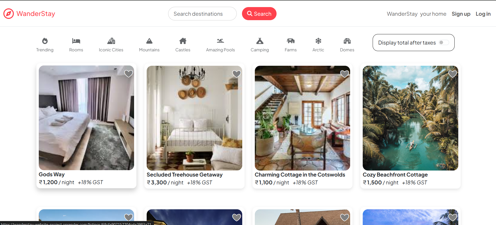
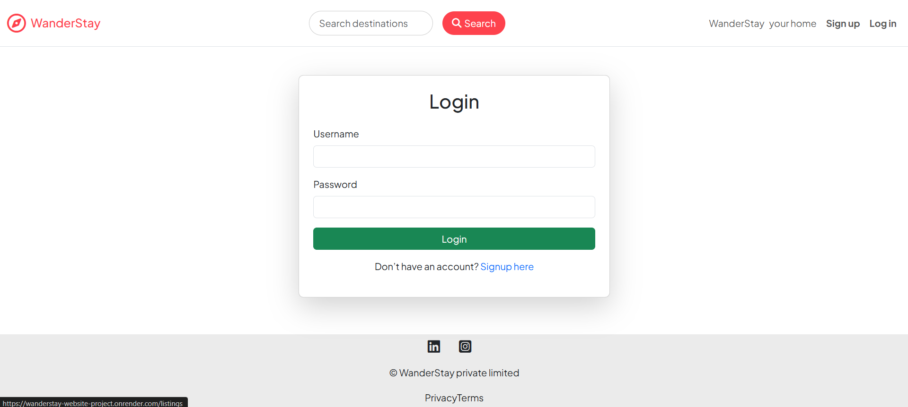
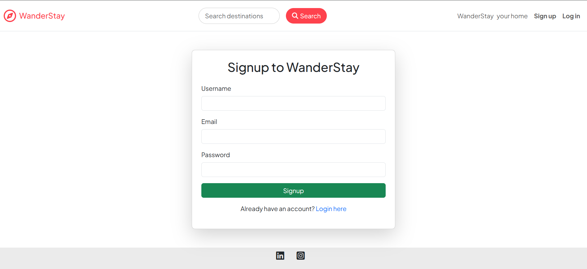

# 🏨 WanderStay

A full-stack MERN web application inspired by Airbnb that allows users to discover, create, manage, and review property listings with secure user authentication and cloud-based image storage.

---

## 📌 Overview

WanderStay is a vacation rental platform where users can browse accommodations, create their own property listings, upload images, and share reviews. The application follows the MVC architecture and demonstrates complete CRUD functionality with secure authentication and authorization.

---

## ✨ Features

### 👤 User Authentication
- User Registration
- User Login & Logout
- Secure Password Hashing
- Session-Based Authentication
- Authorization for Protected Routes

### 🏠 Property Listings
- View All Listings
- View Listing Details
- Create New Listings
- Edit Existing Listings
- Delete Listings

### 📷 Image Upload
- Upload Property Images
- Cloudinary Integration
- Multer File Upload

### ⭐ Reviews
- Add Reviews
- Delete Reviews
- Rating System

### 🛡 Security
- Form Validation using Joi
- Error Handling Middleware
- Session Management
- Flash Messages

### 📱 Responsive Design
- Responsive User Interface
- Bootstrap 5
- Mobile Friendly Layout

---

## 🛠 Tech Stack

### Frontend
- HTML5
- CSS3
- Bootstrap 5
- EJS

### Backend
- Node.js
- Express.js

### Database
- MongoDB Atlas
- Mongoose

### Authentication
- Passport.js
- Express Session

### Cloud Storage
- Cloudinary
- Multer

### Other Libraries
- Joi
- Method Override
- Connect Flash
- Dotenv

---

## 📂 Project Structure

```text
WanderStay/
│── controllers/
│── middleware/
│── models/
│── public/
│── routes/
│── utils/
│── views/
│── app.js
│── package.json
│── README.md
│── .gitignore
```

---

## 📸 Screenshots

### 🏠 Home Page



---

### 🔐 Login Page



---

### 📝 Signup Page



---

### ➕ Add Property


---

### 🏡 Property Details


---

## 🚀 Key Functionalities

- User Authentication & Authorization
- Complete CRUD Operations
- Image Upload & Storage
- Property Reviews
- Secure Session Management
- MVC Architecture
- RESTful Routing

---

## 📄 License

This project is developed for educational and learning purposes.